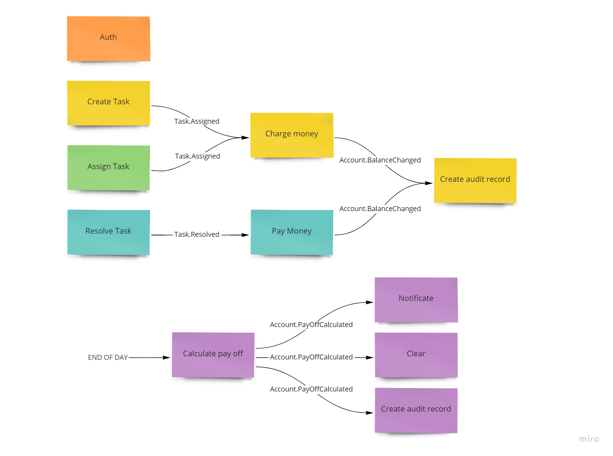
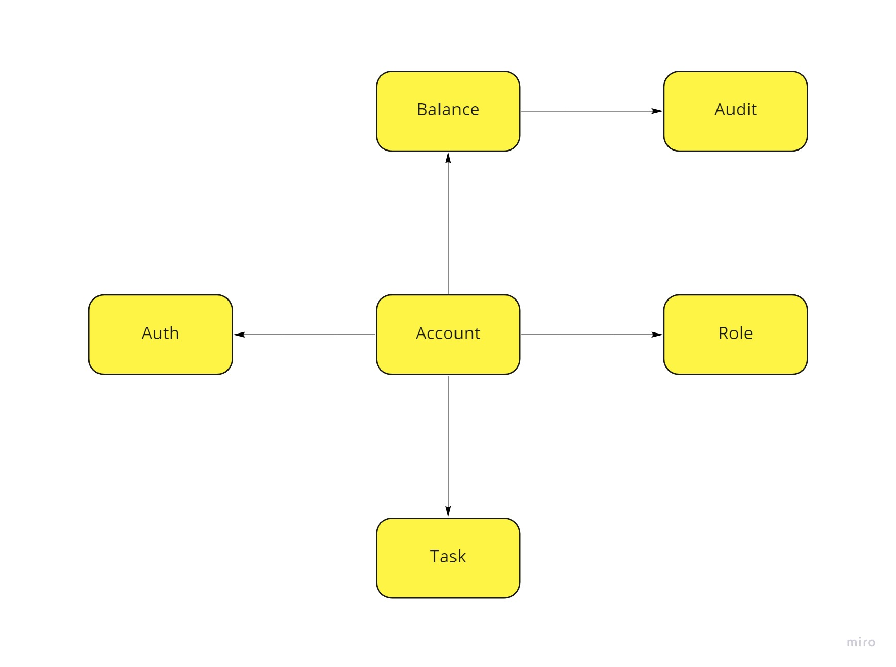
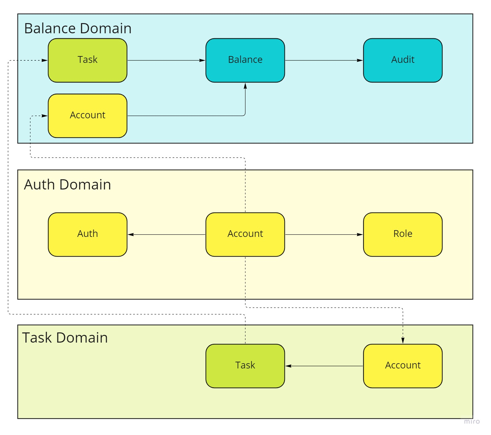

# Popug Task Tracker

## Topics and events

- `accounts-stream` Topic/Exchange, `AccountCreated` event (https://github.com/davydovanton/popug-inventory/blob/separate-auth-service-in-docker/event_schema_registry/schemas/accounts/created/1.json)
- `accounts-stream` Topic/Exchange, `AccountUpdated` event (https://github.com/davydovanton/popug-inventory/blob/separate-auth-service-in-docker/event_schema_registry/schemas/accounts/updated/1.json)
- `accounts-stream` Topic/Exchange, `AccountDeleted` event (https://github.com/davydovanton/popug-inventory/blob/separate-auth-service-in-docker/event_schema_registry/schemas/accounts/deleted/1.json)
- `accounts` Topic/Exchange, `AccountRoleChanged` event (https://github.com/davydovanton/popug-inventory/blob/separate-auth-service-in-docker/event_schema_registry/schemas/accounts/role_changed/1.json)

## Routes

- `localhost:3000` - main
- `localhost:3000/oauth/applications` - oauth app managment
- `localhost:8000' - task tracker
- `localhost:8080` - accounting

## How to start oAuth with kafka broker

```bash
docker-compose build

docker network create popug-jira

docker-compose run oauth rake db:create
docker-compose run oauth rake db:migrate

docker-compose up
```

# System Architecture

- [x]  Разобрать каждое требование на составляющие (актор, команда, событие, query). Определить, как все бизнес цепочки будут выглядеть и на какие шаги они будут разбиваться.
    
    ### **Таск-трекер**
    
    1. Авторизация в таск-трекере
        - Actor — Account
        - Command — Auth
        - Data — ???
        - Event — Account.Authorised
    2. Новые таски может создавать кто угодно (администратор, начальник, разработчик, менеджер и любая другая роль). У задачи должны быть описание, статус (выполнена или нет) и попуг, на которого заассайнена задача.
        - Actor — Any user(account with any role)
        - Command — Add task
        - Data — Task + Account public id
        - Event — Task.Assigned
    3. Менеджеры или администраторы должны иметь кнопку «заассайнить задачи».
        - Actor — Manager or Admin user(account with “manager” or “admin” role)
        - Command — Shuffle task
        - Data — Task + Account public id
        - Event — Task.Assigned
    4. Каждый сотрудник должен иметь возможность отметить задачу выполненной
        - Actor — Account
        - Command — Resolve Task
        - Data — Task
        - Event — Task.Resolved
    
    ### **Аккаунтинг: кто сколько денег заработал**
    
    1. Авторизация в дешборде аккаунтинга должна выполняться через общий сервис аутентификации UberPopug Inc.
        - Actor — Account
        - Command — Auth
        - Data — ???
        - Event — Account.Authorised
    2. Деньги списываются сразу после ассайна на сотрудника, 
         - Actor — “Task.Assigned” event
         - Command — Apply charge transaction
         - Data — Account
         - Event — Transaction.Applied
    3. Начисляются деньги после выполнения задачи.
        - Actor — “Task.Resolved” event
        - Command — Apply pay transaction
        - Data —  Account
        - Event — Transaction.Applied
    4. В конце дня необходимо считать сколько денег сотрудник получил за рабочий день
        - Actor — “End of day” event
        - Command — Close billing cycle(Apply payment transaction)
        - Data — Balance
        - Event — Transaction.Applied
    
    ### **Account management**

    1. Регистрация Account
        - Actor — Manager or Admin user(account with “manager” or “admin” role)
        - Command —  Register account
        - Data — Account
        - Event — Account.Created
    2. Изменение роли Account
         - Actor — Manager or Admin user(account with “manager” or “admin” role)
         - Command — Change Account Role
         - Data — Account
         - Event — Account.RoleChanged
    
    ### Business chain:
    
    
        
- [x]  Построить модель данных для системы и модель доменов. Рисовать можно в любом удобном инструменте (включая обычную бумагу), главное, чтобы это было не только у вас в голове, но и где-то вовне. Благодаря этому вы сможете сфокусироваться на отдельной части системы, не думая о других. А также показать свое решение одногрупникам/коллегам.
    
    ### **Data model**
    
    
    
    ### **Domen model**
    
    
    
- [x]  Определить, какие общие данные нужны для разных доменов и как связаны данные между разными доменами.
    - Balance - Account and Task
    - Auth - No need additional data
    - Task - Account

- [x]  Разобраться, какие сервисы, кроме тудушника, будут в нашей системе и какие между ними могут быть связи (как синхронные, так и асинхронные).
    1. Account management
    2. Billing
    3. Task management
    
    - Апдейты аккаунта - Balance и Task - async
    - Апдейты таски - Balance - async
    - Вызов изменений аккаунта - async
    - Создание сущностей- sync
    - Авторизация - sync
    
- [x]  Определить все бизнес события, необходимые для работы системы. Отобразить кто из сервисов является продьюсером, а кто консьюмером бизнес событий.
    - Account.Authorised — None
    - Task.Assigned — pr: Task, c: Balance
    - Task.Resolved — pr: Task, c: Balance
    - Balance.Changed — pr: Balance, c: Balance
    - End of day — pr: None, c: Balance

- [x]  Выписать все CUD события и какие данные нужны для этих событий, которые необходимы для работы системы. Отобразить кто из сервисов является продьюсером, а кто консьюмером CUD событий.
    - Account.Created: 
      - pr: Account Service, 
      - c: Billing: create account with balance, 
      - c: Task management: create account
    - Task.Created: 
      - pr: Task management, 
      - c: Balance create task with costs